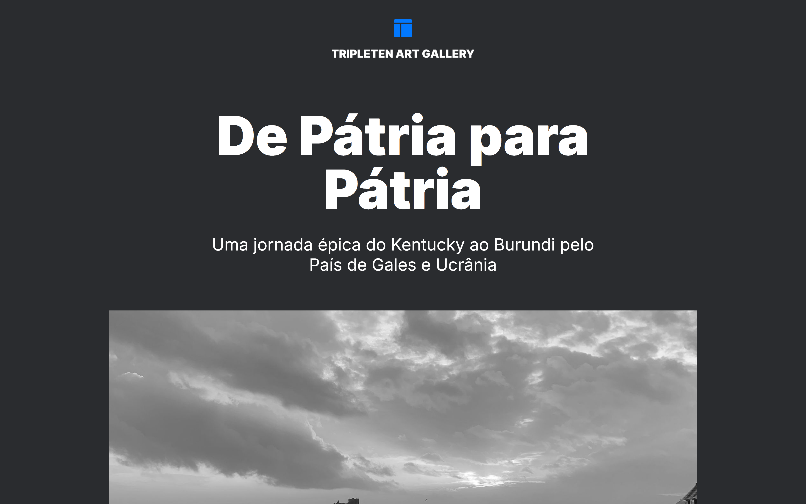

# TripleTen Art Gallery

## Descrição do Projeto

O projeto TripleTen Art Gallery é uma galeria de arte online que exibe uma coleção diversificada de obras de arte. O objetivo é proporcionar uma experiência visual agradável e acessível para os amantes da arte, permitindo que explorem e apreciem diferentes estilos e artistas.

## Tecnologias Utilizadas

- HTML5
- CSS3
- Metodologia BEM (Block, Element, Modifier)
- GitHub Pages

## Acesso ao Site

Você pode acessar o site através do seguinte link: [TripleTen Art Gallery](https://kalebeccs.github.io/web_project_homeland/)

## Preview

